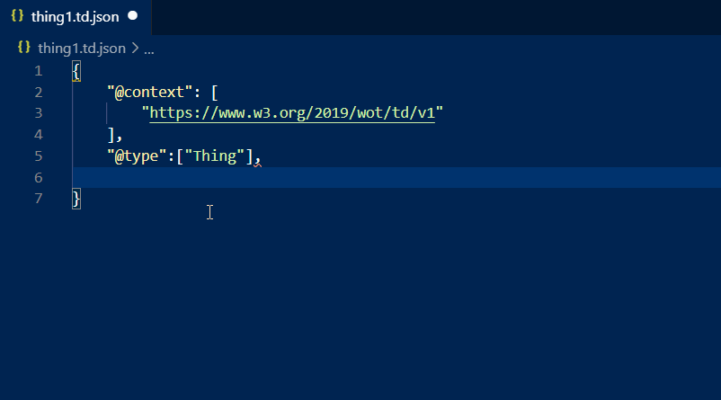
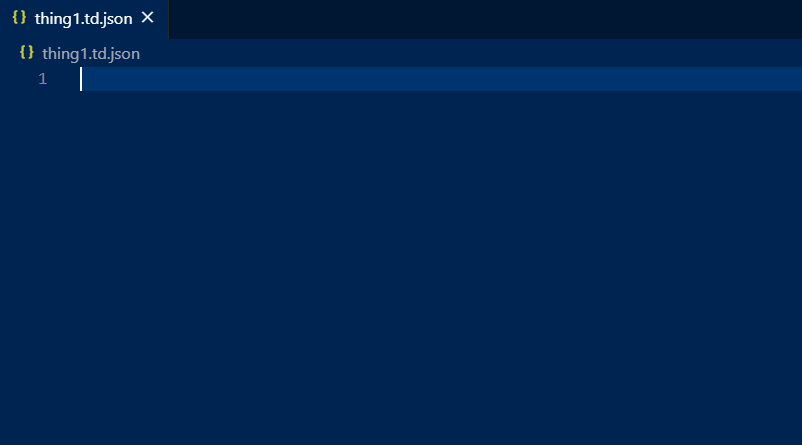

# TD-code

TD-code is a simple vscode extension that adds W3C Thing Description JSONSchema and some code snippets for `td.json` and `td.jsonld` files.

## Features

For each file with `td.json` or `td.jsonld` extension you will get intellisense code completion base on a modified version of the JSONSchema provided in the [W3C Thing Description](https://www.w3.org/TR/wot-thing-description/#json-schema-for-validation) specification page. VSCode will also validate your Thing Description following the rules described in the schema.  

For example, in this animation you can see the code completion in action:

TD-code provide also some useful code snippets to accelerate Thing Description setting up and design time.

## Release Notes
### 0.3.0
Additional snippets for: events,properties,actions,securitySchema,and links

### 0.2.3
Update release notes

### 0.2.2

Fix TD JSONSchema location
Fix typos in the package description

### 0.2.1

Fix up minor publishing material

### 0.2.0

Initial release
